## JENKINS INSTALLATION DIRECTLY ON THE LINUX SERVER(UBUNTU)

Here’s a step-by-step guide to set up a Jenkins account on an AWS Free Tier EC2 instance without using Docker. I'll install Jenkins directly on the machine for persistence
### Step 1: Set Up Your AWS EC2 Instance
1) Log in to AWS Management Console:
    * Navigate to EC2 DASHBOARD
2) Launch a new EC2 instance
   * AMI: Use the Ubuntu Server 22.04 LTS (Free Tier eligible
   * Instance Type: Select t2.micro (Free Tier eligible).
   * Key Pair: Create a new key pair (or use an existing one) for SSH access.
   * Security Group
     * Allow port 22 for SSH.
     * Allow port 8080 for Jenkins.
   * Launch the instance.
3) Connect to the Instance:
   * Use the following command to connect:
```bash
ssh -i "your-key.pem" ubuntu@your-ec2-public-ip
```
but I use termius instead
## Step 2: Install Jenkins on the EC2 Instance
the ```jenkins_install.sh``` script will install Jenkins

## **Expose the Jenkins instance to browser**
This is done by adding the port number 8080 as shown below:
.gif>)


## Step 3: Access Jenkins
1) Open a browser and navigate to:
    
    ```plaintext
    http://your-ec2-public-ip:8080
    ```
    It should show like this if done properly.
    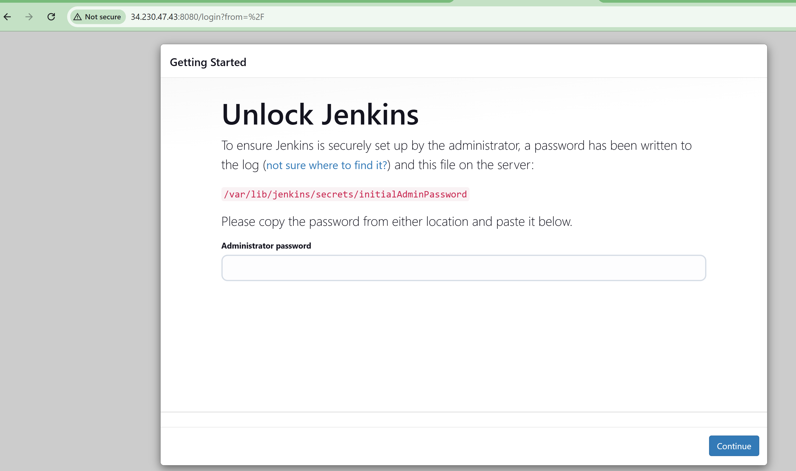
2) Unlock Jenkins:
    * Locate the password using:
    ```bash
    sudo cat /var/lib/jenkins/secrets/initialAdminPassword
    ```
   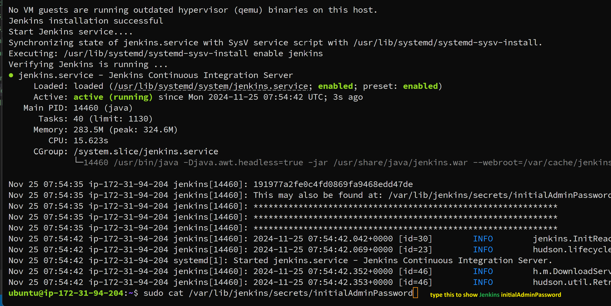 
    * Copy and paste it into the Jenkins setup wizard.
  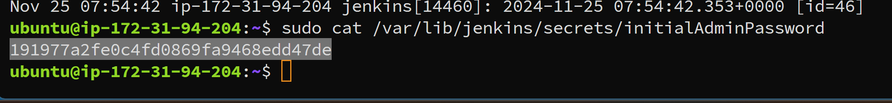
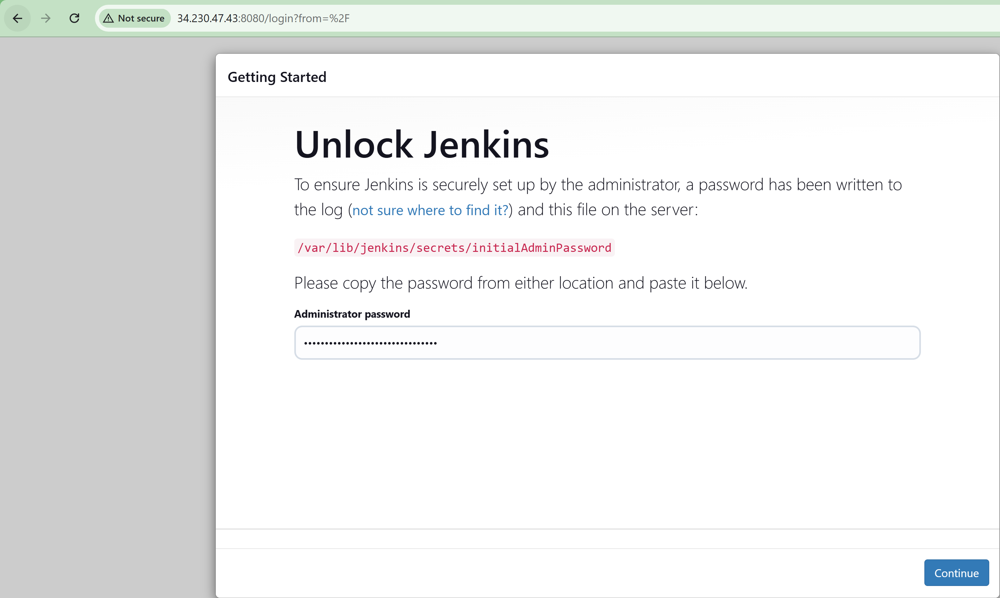
click continue
3) Set Up Jenkins:
   * Install suggested plugins.
   * Create your admin user account.
   * Complete the setup.
  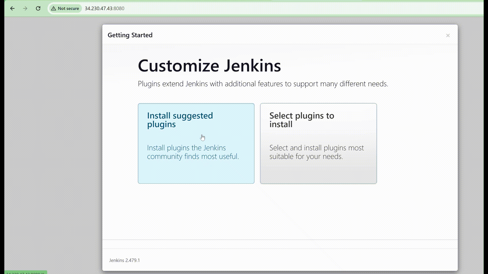

 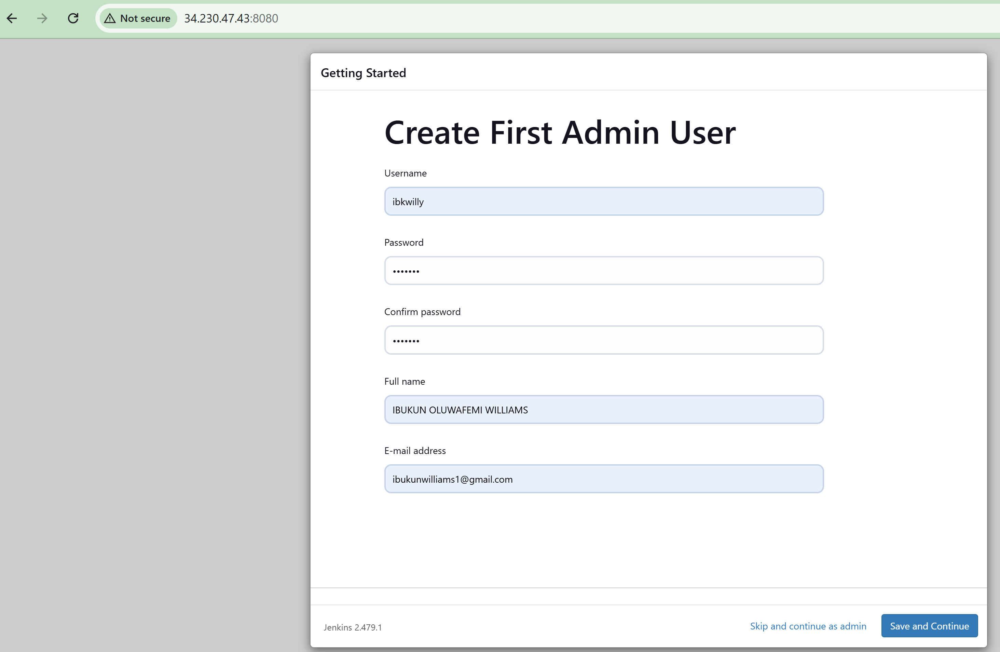
 CLick save and continue
 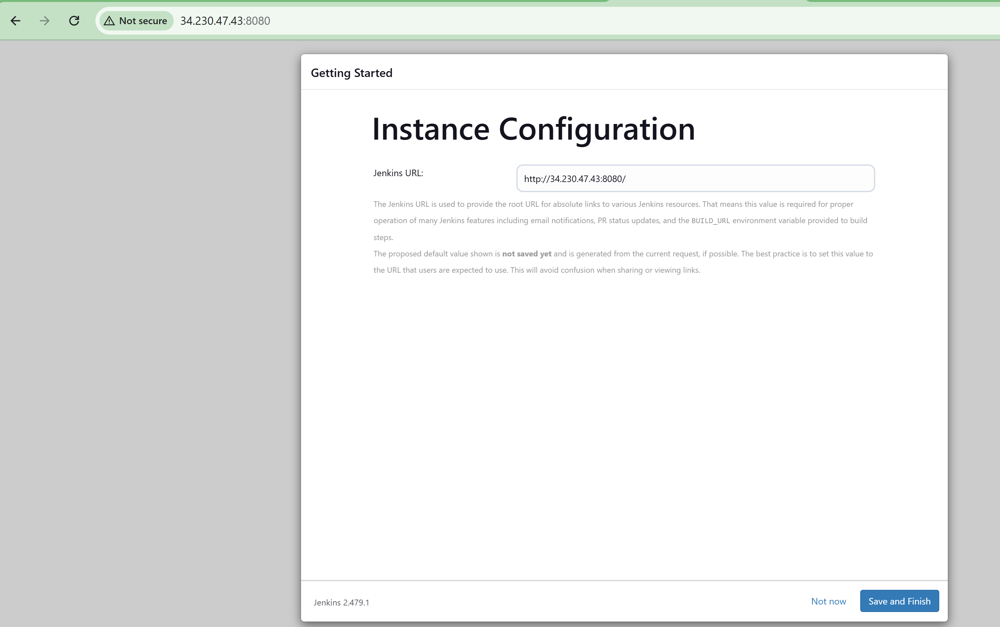
 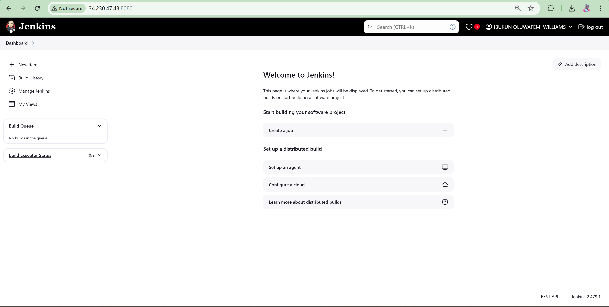
## Step 4:Change Jenkins Port to Your Preferred Port
1) **Edit Jenkins configuration**
    ```bash
    sudo nano /etc/default/jenkins
    ```
    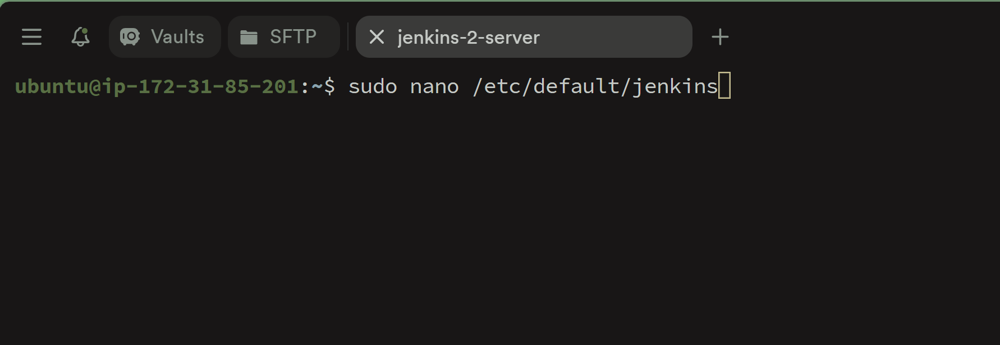
    
2) **Find the line that sets the HTTP_PORT variable and update it to your desired port:**
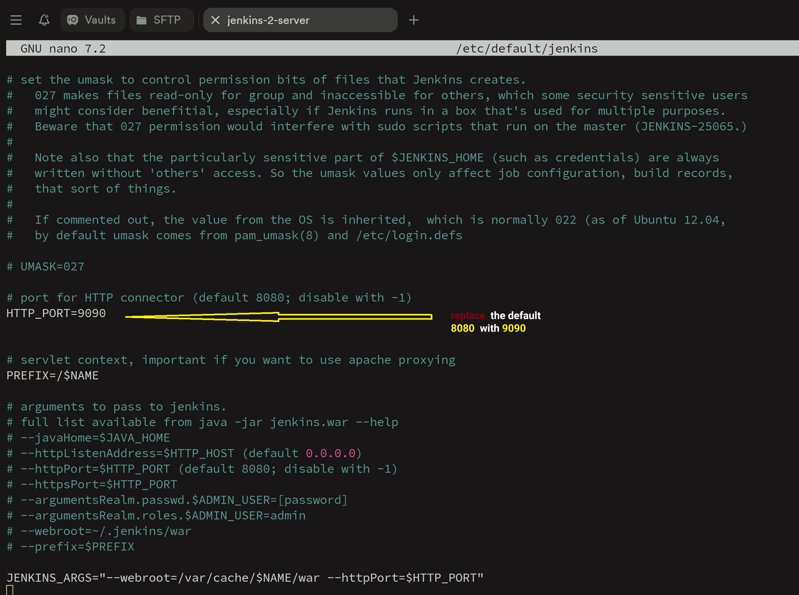
```bash
HTTP_PORT=8080
```
Save and exit the editor (Ctrl + O, then Ctrl + X if using nano).
Jenkins can use any open and available port on your system, but here are some commonly preferred alternatives to port 8080:
***Popular Port Options:***
* 8081 or 8082: Often used as alternatives when 8080 is in use
* 8090: A close and convenient choice for developers.
* 8000 or 8001: Frequently used for development-related applications.
* 8181 or 8282: Slightly higher, less commonly clashing with other services.
1) **Restart the Jenkins Service**
 Use the following command to restart Jenkins:
    ```bash
    sudo systemctl restart jenkins
    ```
1) **Verify the Service Status**
   Check whether Jenkins restarted successfully:
    ```bash
    sudo systemctl status jenkins
    ```
***You should see ``"active (running)"`` in the output.***

1) **Confirm the New Port**
Once the service is restarted, confirm Jenkins is accessible on the new port:
```curl http://<your_server_ip>:<new_port>```


Replace <your_server_ip> with your server's IP address and <new_port> with the updated port number.
### Additional Tips:

Ensure the new port is open in the server’s firewall. For example, to open port 9090, use

```bash
sudo ufw allow 9090
```


***Tips for Choosing a Port:***
Avoid Conflict: Ensure the port isn't already in use by another service (e.g., Tomcat, HTTP servers, or other apps).
Firewall Rules: Check if the chosen port is allowed by your firewall or network configuration.
Organizational Standards: Some organizations have specific guidelines for port allocation.

Problem I ran into when I tried to to connect to the Jenkins server with the port 9090
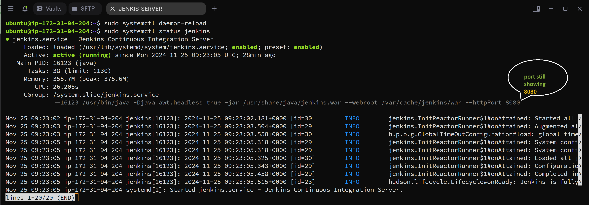

Failed to connect to jenkins at port 9090
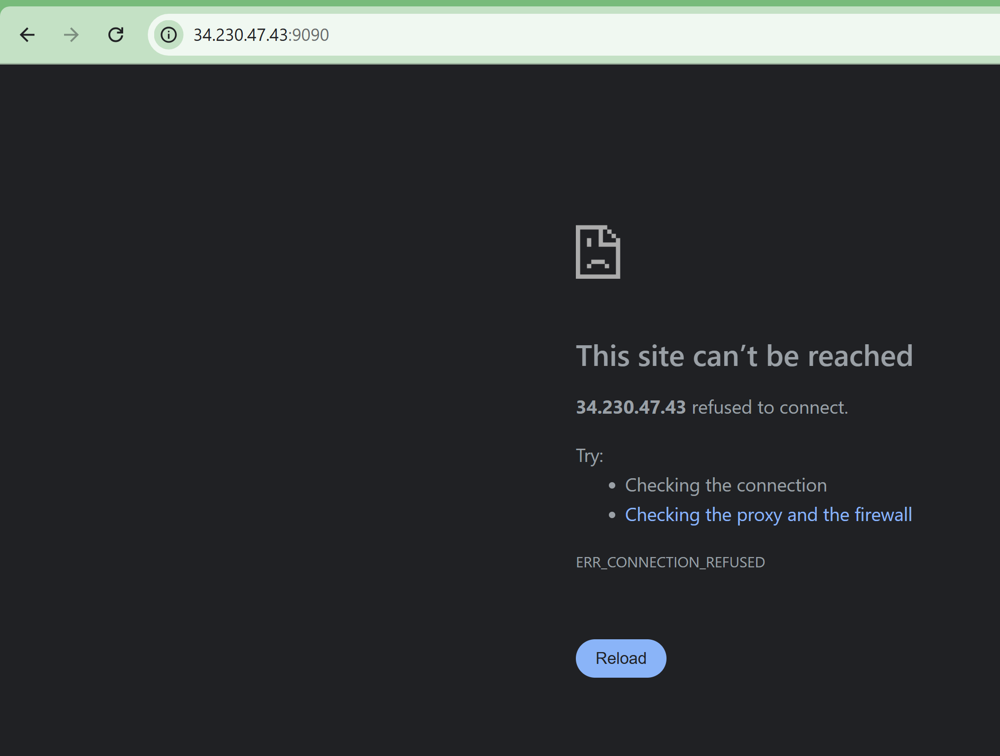
But still connecting to jenkins at port 8080 after I effect change
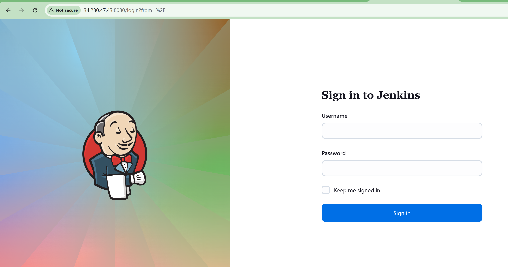
